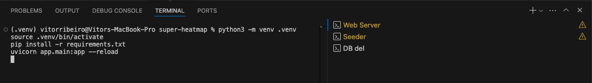
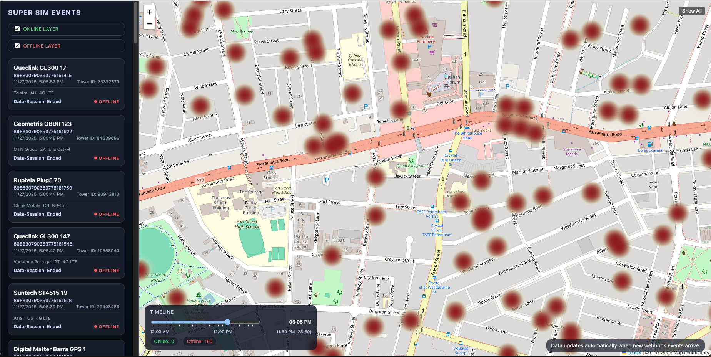
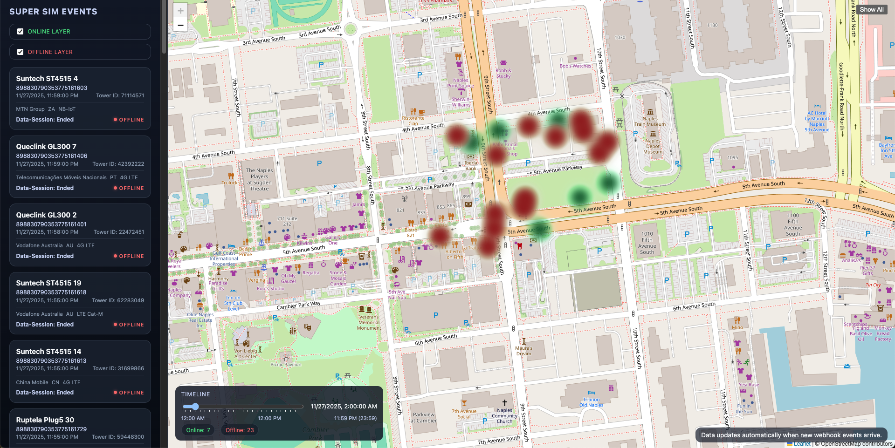
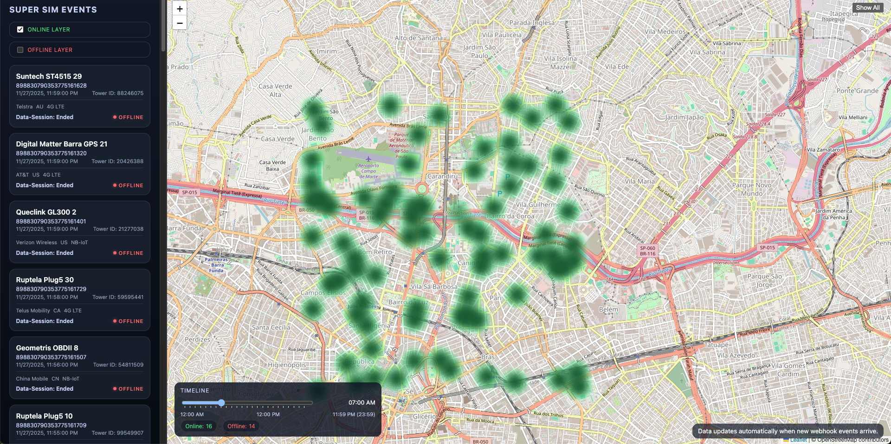
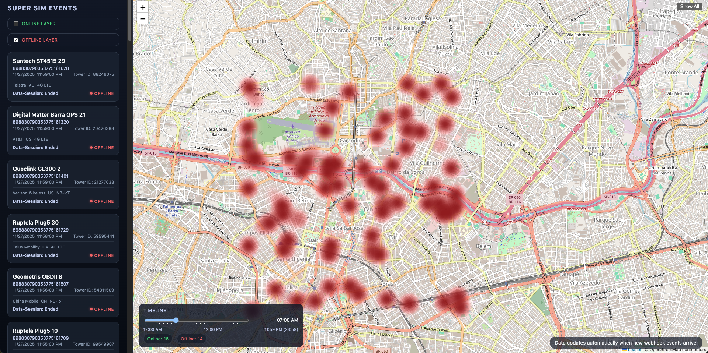
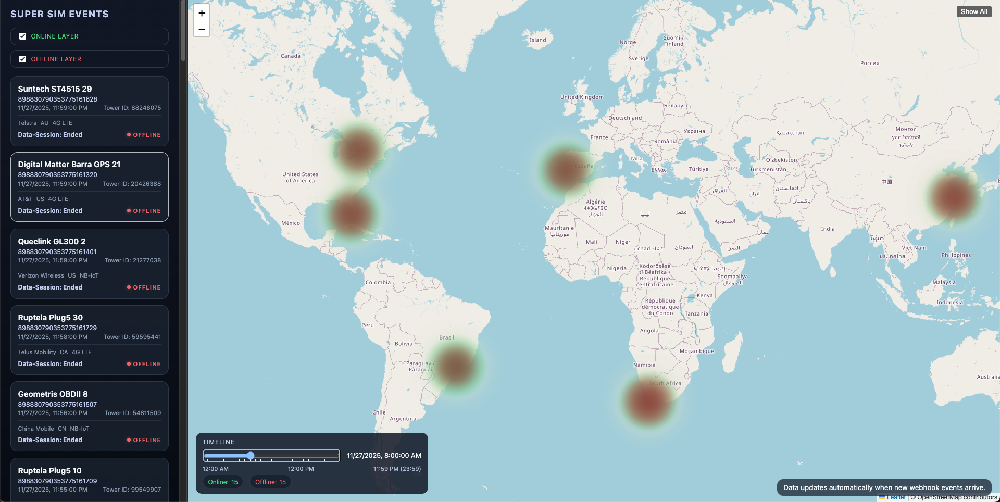

# Visualizing KORE SUPER SIM Event Streams in Real Time

Hi there, my name is **Vitor Ribeiro**, and I am a **Solutions Architect** at **KORE Wireless**.

In this article, I’ll show you how I built a full real-time geospatial visualization tool for [**KORE SUPER SIM**](https://www.korewireless.com/super-sim/) using the **Event Streams**, [**FastAPI**](https://fastapi.tiangolo.com/), and [**Leaflet**](https://leafletjs.com/) using [**OpenAI Codex**](https://openai.com/codex/)

You can download the code from my [**GitHub repository here**](https://github.com/naturalfunction/KORE-SUPERSIM-heatmap)

New to Event Streams? Start with my [**Getting Started with KORE SUPER SIM Event Streams**](/p/getting-started-with-kore-super-sim-event-streams/) guide first.

---

## ⭐ What the App Does
Super SIM Heatmap provides:

- Real-time Super SIM event ingestion  
- Persistent storage of CloudEvents payloads  
- Dual online/offline heatmap layers  
- Timeline slider for replay  
- Device event feed with metadata  
- Click-to-pan tower visualization  

---

## 🌍 Why Visualize Super SIM Events?
KORE SUPER SIM emits session lifecycle events such as:

- `connection.data-session.started`
- `connection.data-session.updated`
- `connection.data-session.ended`

Visualizing them helps teams understand connectivity patterns and issues across geography and time.

---

## 🧱 Architecture Overview
```
FastAPI     → Webhook ingestion  
SQLite      → Raw event persistence  
SQLModel    → ORM  
Leaflet     → Heatmap rendering  
Jinja2      → Templates  
```

---

## ⚡ Webhook Ingestion
The webhook endpoint:

```
POST /webhooks/supersim
```

Validates, extracts, and persists raw event payloads.

---

## 🔥 Dual-Layer Heatmap
- Green = online  
- Red = offline  

State is inferred by latest event per ICCID.

---

## ⏱ Timeline Scrubbing
Scrub 00:00–23:59 and reconstruct fleet activity by timestamp.

---

## 📋 Device Event Sidebar
Shows:

- ICCID  
- Tower  
- Network  
- RAT  
- Timestamp  

---

## 🤖 Synthetic Data Seeder
Simulates START → UPDATE → END events across global cities.

Example:

```
.venv/bin/python scripts/seed_events.py --region naples --devices 50 --count 550
```

---

## 🧪 Manual cURL Tests
Includes samples for all session lifecycle events.

---

## 🖥 Web UI Overview
- Device sidebar  
- Heatmap toggles  
- Timeline slider  
- Stats counters  

---

## 📁 Project Structure
```
app/
scripts/
templates/
static/
docs/
```

---

## 🛠 Quick Start
```
python3 -m venv .venv
source .venv/bin/activate
pip install -r requirements.txt
uvicorn app.main:app --reload
```

---



## 🛠 Seed sample data


50 devices in Naples, ~550 sessions total

```
.venv/bin/python scripts/seed_events.py --region naples --devices 50 --count 550
```

30 devices in every region, 5 sessions each
```
for region in naples toronto saopaulo lisbon shanghai capetown sydney; do
  .venv/bin/python scripts/seed_events.py --region "$region" --devices 30 --sessions-per-device 5
done
```

---

## 🛠 Map Examples

Map after seeding data


Map after filtering data using the Timeline


Map after filtering data using the Timeline Online Only.


Map after filtering data using the Timeline Offline Only.


Map after clicking SHOW ALL
