 

## Introduction

Hi there, my name is **Vitor Ribeiro**, and I am a **Solutions Architect** at [**KORE Wireless**](http://korewireless.com). 

Part of my job includes onboarding customers on our [**Developer Portal**](http://developer-app.korewireless.com) for our Kore ONE API ecosystem, that also includes the SMS API. This article covers frequently asked questions about our [**SMS API**](https://developer.korewireless.com/api?product=SMS#overview) and how to get started.

---

## Prerequisites

You can view the [**Developer Portal API documentation**](http://developer-app.korewireless.com), but to view and manage your API keys, you must be contracted for **KORE Wireless ConnectivityPro™**.  
Otherwise, you won’t be able to see the **Authentication endpoint** described below.

If you are **not** a KORE Wireless customer and are interested in our services, [contact us here](https://www.korewireless.com/contact-us/).

You don’t need to be a software developer but should be familiar with what a **REST API** is.  
AWS has [this article](https://aws.amazon.com/what-is/restful-api/) on REST APIs that can help.  

For API calls, this article uses **Postman**.  
You can watch their [101 videos](https://www.youtube.com/watch?v=hISzpFJ5fPs) or view their [**webinar**](https://www.postman.com/events/intergalactic/) for a quick start.

---

## Overview

The [**Developer Portal**](http://developer-app.korewireless.com) is a public web page for customers, partners, and builders to integrate and leverage **KORE Wireless Services** through APIs.

It enables KORE Wireless to manage all APIs from a single point — referred to as **KORE One™**.

### Available APIs

| API | Description |
|------|-------------|
| **Connectivity** | For ConnectivityPro™; manage SIM subscriptions. |
| **Streaming** | For ConnectivityPro™; KORE’s streaming engine provides developers real time data streams which can be delivered to your infrastructure so you can build solutions with data. |
| **SMS** | For ConnectivityPro™, to send and receive SMS to your SIMs. |

This article focuses on the [**SMS API**](https://developer-app.korewireless.com/api?product=SMS#overview), which allows you to send & receive SMS to your SIMs via API.

---
## Introduction

### Creating a Client

Once you have access to the Developer Portal:

1. Follow the [**Getting Started**](https://developer-app.korewireless.com/getting-started?id=2.1.1.5) guide to create your first [**client**](https://developer-app.korewireless.com/getting-started?id=2.1.1.1).  
2. Selecting the client will let you view your **Production** keys.

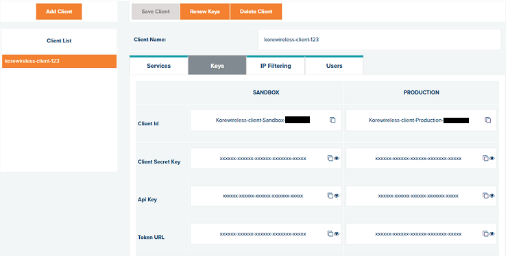 

---
### Getting an Authentication Token

Source: [Developer Portal – Getting Started](https://developer.korewireless.com/getting-started?id=2.1.1.3)

KORE uses the **OAuth 2.0 Client Credentials Workflow**.

When you create a client, you receive:

- **Client ID** – Unique identifier of your application  
- **Client Secret** – Used for secure API calls  
- **API Key** – Allows KORE to identify client access

See below for a high-level overview.

 

Using Postman, set up a POST request to https://api.korewireless.com/Api/api/token for Production. 

The body of your request must include:

- The key **“grant_type”** key with a value of “client_credentials”.
- The key **“client_id”** key with a value from the Developer Portal.
- The key **“client_secret”** key with a value from the Developer Portal.

 

You can also use **cURL** to get an authentication token, use the example below to perform a request.

<pre style="background:#1e1e1e;color:#dcdcdc;padding:1em;border-radius:8px;">
<code>
curl -L -X POST "https://api.korewireless.com/Api/api/token" \
  -H "Content-Type: application/x-www-form-urlencoded" \
  -d "grant_type=client_credentials" \
  -d "client_id=[REPLACE_WITH_YOUR_INFO]" \
  -d "client_secret=[REPLACE_WITH_YOUR_INFO]"
</code>
</pre>

Here’s what the **cURL** returns:

 

The authentication Token is valid for 10 hours, after 10 hours, you will need to call the authentication endpoint again for a new token.

---

### Getting the Subscription details

Before you begin sending a Mobile Terminating (MT) SMS to your SIM, you must obtain some subscription details, for this, you will need to call the [**List All Subscription Details endpoint**](https://developer-app.korewireless.com/api?product=Connectivity#get-/v1/accounts/-account-id-/subscriptions). If you are not familiar with our Connectivity API, please read [**this article**](https://vitorribeiro.com/p/getting-started-with-kore-connectivitypro-api/).

For this example, I am using [**Kore OmniSIM**](https://www.korewireless.com/omnisim/) Reach SIM card, and I will be searching for the subscription details using the ICCID value 8910390000075864728.

<pre style="background:#1e1e1e;color:#dcdcdc;padding:1em;border-radius:8px;">
<code>
curl --location 'https://api.korewireless.com/connectivity/v1/accounts/cmp-pp-org-310/subscriptions?page-index=0&max-page-item=1&iccid=8910390000075864728' \
--header 'Accept: application/json' \
--header 'x-api-key: <INSERT_YOUR_API_KEY_HERE>' \
--header 'Authorization: Bearer <INSERT_YOUR_AUTH_TOKEN_HERE>'
</code>
</pre>

After sending the GET request, you should receive a JSON response containing all subscription details, we are interested in the MSISDN value, and the phone number of this subscription.

<pre style="background:#1e1e1e;color:#dcdcdc;padding:1em;border-radius:8px;">
<code>
{
    "page-info-result": {
        "total-count": 1,
        "page-index": 0,
        "max-page-item": 1
    },
    "subscriptions": [
        {
            "subscription-id": "cmp-k1-subscription-56542824",
            "iccid": "8910390000075864728",
            "eid": "89001039450780168000000000081331",
            "rsp-state": "",
            "product-offer": "OmniSIM Reach",
            "product-offer-type": "Switchable (Kigen V3)",
            "imei": "35147485127936",
            "serial": "",
            "model": "",
            "imsi": "204303130002277",
            "msisdns": [
                {
                    "msisdn": "3197042222077"
                }
            ],
            "service-type-id": "32",
            "states": [
                {
                    "state": "Active",
                    "state-id": "cmp-pp-state-Active",
                    "start-datetime-utc": "2024-05-17T14:30:29.000Z",
                    "end-datetime-utc": "9999-12-31T00:00:00.000Z",
                    "is-current": true
                }
            ],
            "cost-center-id": "21287",
            "profiles": [
                {
                    "profile-id": "55332",
                    "start-datetime-utc": "2024-05-24T00:00:00.000Z",
                    "end-datetime-utc": "9999-12-31T00:00:00.000Z",
                    "is-current": true
                }
            ],
            "apn-data": [
                {
                    "ip-address": "10.34.47.210",
                    "apn-id": "3361"
                }
            ],
            "additional-fields": [],
            "last-active-profile": [
                {
                    "profile-id": 55332,
                    "start-datetime-utc": "2024-05-24T00:00:00.000Z "
                }
            ],
            "last-active-imsi-msisdn": [
                {
                    "imsi": "204303130002277",
                    "msisdn": "3197042222077",
                    "start-datetime-utc": "2024-02-02T13:04:58.013Z"
                }
            ],
            "last-effective-date-of-states": [
                {
                    "state": "Active",
                    "start-date-time-utc": "2024-05-17T14:30:29.000Z"
                },
                {
                    "state": "Stock",
                    "start-date-time-utc": "2024-02-28T16:02:07.090Z"
                }
            ]
        }
    ]
}
</code>
</pre>

You can also obtain the MSISDN value using our ConnectivityPro web app using the Subscription details page https://connect.korewireless.com/subscriptions/8910390000075864728

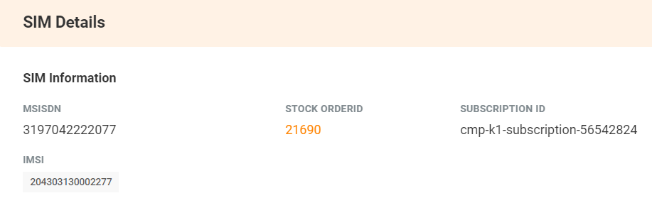 

## SMS API

### Sending a Mobile Terminated SMS

This guide is an interpretation of our official guide from our [**SMS API on the Developer Portal**](https://developer-app.korewireless.com/api?product=SMS#overview), you can find the file here

Now that you have obtained your phone number/MSISDN value, we can proceed to building our SEND SMS Payload.

<pre style="background:#1e1e1e;color:#dcdcdc;padding:1em;border-radius:8px;">
<code>
{
  "from": "string",
  "subscription-id": "string",
  "iccid": "string",
  "msisdn": "string",
  "message": "string",
  "message-type": "TEXT"
}
</code>
</pre>

**from (optional)**

Set this to the sender ID or originator address (OA) of the SMS, usually the sender's phone number, but it can also be an alphanumeric string of up to 11 characters. Be aware that mobile networks often mark SMS as spam if an alphanumeric OA is used or if the number is not an approved short-code for the Service Type. SMS marked as spam might not be delivered to the device. To allow the device to "reply" to the SMS, always use the Service Type specific short-code, as only SMS sent from the SIM to this address will be delivered back via the API.

<pre style="background:#1e1e1e;color:#dcdcdc;padding:1em;border-radius:8px;">
<code>
/ Service type	        // Short code
KATTCC	                53340999
KORE Canada GSM 2	720096
KORE ESIM BLUE	        567300908
KORE ESIM GREEN	        567300909
KORE ESIM RED	        567300910
KORE OmniSIM	        567300905
KORE T-USA	        567300025
KORE T-USA H	        567300026
KORE T-USA W	        567300027
KORE USA GSM (Gold)	20020499
</code>
</pre>

**subscription-id**

This is the unique KORE ID assigned to your SIM/Subscription
(*) At least one of the parameters (subscription-id, iccid, or msisdn) must be used.

**msisdn**

The destination address (DA) is where the SMS is being sent and must always be the MSISDN assigned to the SIM that will receive the SMS. The MSISDN should be in the international format, starting with the country code but without the preceding plus (“+”) sign. The SMS API does not support “off-net” SMS, so messages can only be sent to SIMs associated with the API keys used.3
(*) At least one of the parameters (subscription-id, iccid, or msisdn) must be used.

**iccid**

The ICCID or Integrated Circuit Card Identifier, is the unique number assigned to every SIM card, it is a serial number that identifies your SIM card.
(*) At least one of the parameters (subscription-id, iccid, or msisdn) must be used.

**message**

The content or body of the SMS currently supports only the GSM 03.38 basic character set. Characters from the basic character set extension are not supported. A single SMS can be up to 160 characters. If the message exceeds this length, it will be sent as multiple parts, forming a “concatenated SMS,” with each part transmitted and charged as an individual SMS. For example, a message with 161 characters will be charged as two SMSs.

Our final assembled payload after inputing the fields:

<pre style="background:#1e1e1e;color:#dcdcdc;padding:1em;border-radius:8px;">
<code>
{
  "from": "567300905",
  "msisdn": "3197042222077",
  "message": "Smile if you are reading this",
}
</code>
</pre>

After a successful request is sent, you should get a response like this:

<pre style="background:#1e1e1e;color:#dcdcdc;padding:1em;border-radius:8px;">
<code>
{
    "code": 200,
    "status": "OK",
    "message": "Request accepted successfully",
    "mid": "fead2e20-ace7-416f-ae1f-a573873a78d0"
}
</code>
</pre>

Here’s a screenshot of the received SMS message on a [**NEXA Rhino C6 handheld**](https://rhinomobility.com/c6/features).

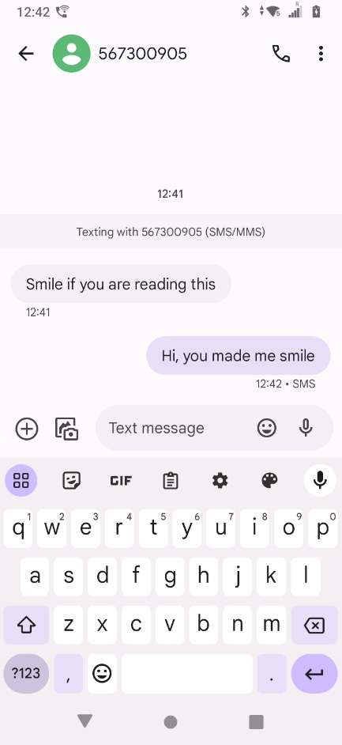

### Receiving a Mobile Originated SMS

Note that in the screenshot above, there’s a Mobile Originated SMS, this is a SMS originated from the C6 mobile device. In this section, we will set up an Alert to receive MO SMS via the Developer Portal.

Whenever a device sends an MO SMS to the allocated short code for the Service Type assigned to the SIM, it will be delivered to the webhook defined in the Alert rule.

The short code for OmniSIM is **567300905**. SMS sent by the device to any other destination will be processed normally.

To configure your SMS-MO Alert, please navigate to Manage Rules,

1. Select the **SMS** entry under Product and

2. Select **Alerting** under Type.

3. Then click the Add Rule button.

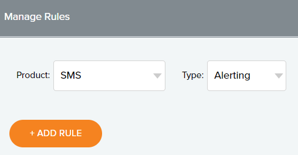

For your Rule:

1. Insert your **Rule name**,

2. Select **Alertting** under Type

3. Select **SMS** under Product

4. Select your the **account-id** under Account Id

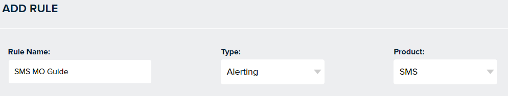

For your Events:

1. Select **message** under Event Category

2. Select **SMS-MO** under Event Type

3. Click **Next**

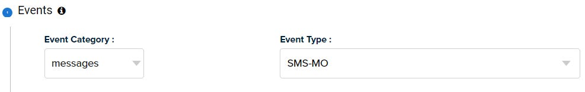

For your Conditions:

1. Select **direction** under Attribute Name

2. Select **==** under Operator

3. Input the value **from_sim** under Attribute Value

4. Click **Next**

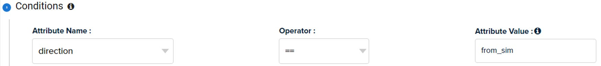

For your Webhook

1. Input your webhook **URL**

2. Click **Next**

In my example I will be using Pipedream

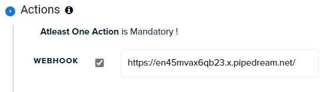

For your Alert Strategy the default value of **Immediate** is selected, please click Save.

Now you are ready to receive MO SMS, give it a try and validate you have an entry like this:

<pre style="background:#1e1e1e;color:#dcdcdc;padding:1em;border-radius:8px;">
<code>
{
  "alert-id": 6683619,
  "alert-message-date": "2024-06-14T16:39:21Z",
  "rule-id": 10783,
  "version-id": 2,
  "rule-name": "OmniSIM Reach",
  "event-name": "connectivity.smsapi.mobileoriginated",
  "account": "cmp-pp-org-310",
  "events": [
    {
      "id": "b4fdd7ab-4f9f-4fcc-bcb9-c6fcbd54cad3",
      "data": {
        "mid": "d3033cf4-e6e6-42ea-9630-0d6e74e09fd2",
        "direction": "from_sim",
        "to": "567300905",
        "from": "3197019407744",
        "message": "Hi,you made me smile",
        "exact-date-time": "2024-06-14T16:39:19.462Z"
      }
    }
  ]
}
</code>
</pre>

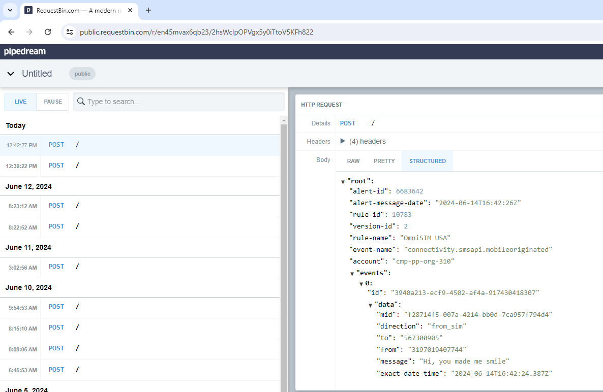

### Creating a Mobile Terminated SMS monitoring queue

Sending an SMS is naturally asynchronous and might not always be instant, so delivery is not always guaranteed. Several factors can prevent SMS delivery; some are permanent and will lead to a failed status, while others are temporary and will be retried for a certain period. Undelivered SMS messages will be queued and retried based on retry policies. For most Service Types, KORE will try to deliver the SMS for 48 hours, but for others, Mobile Network settings may only allow a short retry period.

Due to this asynchronous nature, status changes for the SMS will be reported back to you through Alerts, which you need to configure in the Developer Portal.

To configure your SMS-MT Alert, please navigate to Manage Rules,

1. Select the **SMS** entry under Product and

2. Select **Alerting** under Type.

3. Then click the Add Rule button.

4. Select your the **account-id** under Account Id

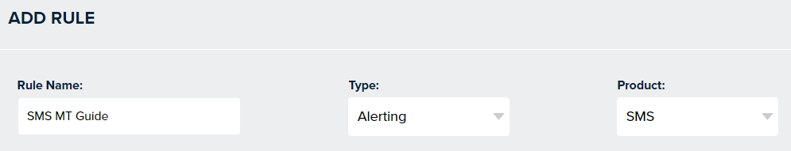

For your Events:

1. Select **message** under Event Category

2. Select **SMS-MT Status** under Event Type

3. Click **Next**

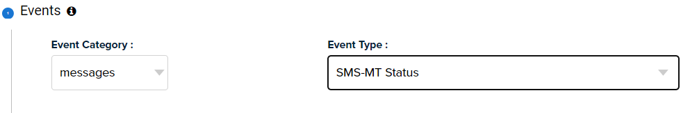

For your Conditions:

1. Select **direction** under Attribute Name

2. Select **==** under Operator

3. Input the value **to_sim** under Attribute Value

4. Click **Next**

For your Webhook

1. Input your webhook **URL**

2. Click **Next**

In my example I will be using Pipedream

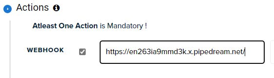

For your Alert Strategy the default value of **Immediate** is selected, please click Save.

Here’s a sample on Pipedream:

Now you are ready to monitor all of the MT SMS sent, note the different possible payloads:

**Accepted**

This is the initial state of the SMS. When a request to send an SMS is received and successfully authenticated and authorized the SMS resource will be created and the MessageId (mid) will be returned in the body of the 200 OK response

**InProgress**

After the SMS has been accepted the SMS will be validated against a set of rules. E.g. does the MSISDN used in the to field belong to the account, is it a valid MSIDN, is the account authorized to send SMS, etc.

There is no Alert triggered when transitioning to this state

**Queued**

All checks in the previous state have passed and the SMS has successfully been delivered to the SMSC which is a node within the Core Mobile Network responsible for storing and forwarding the SMS to the SIM.

<pre style="background:#1e1e1e;color:#dcdcdc;padding:1em;border-radius:8px;">
<code>
{
  "alert-id": 5841598,
  "alert-message-date": "2023-12-20T12:06:09Z",
  "rule-id": 10223,
  "version-id": 2,
  "rule-name": " MT SMS Status ",
  "event-name": "connectivity.smsapi.mobileterminated",
  "account": "cmp-pp-org-14",
  "events": [
    {
      "id": "e9be4741-6e19-4693-9f66-37291a8a1d33",
      "data": {
        "mid": "3b871396-0000-0000-bef4-656c2d483ee4",
        "direction": "to_sim",
        "to": "3197041929445",
        "from": "567300905",
        "status": "Queued",
        "exact-date-time": "2023-12-20T12:06:05.668Z"
      }
    }
  ]
}
</code>
</pre>

**Failed**

An Alert will be triggered when transitioning to this state.

This can happen if any of the checks in the InProgress state did not pass or an error occurred during or after queuing to the SMSC. Typical reasons can be:

  • MSISDN does not belong to the account.
  • the MSISDN is invalid.
  • the from is invalid or not accepted by the Mobile Network.
  • the device is switched off or out of reach during the whole validity period.

An Alert will be triggered when transitioning to this state. Failed messages are not requeued nor retried automatically

<pre style="background:#1e1e1e;color:#dcdcdc;padding:1em;border-radius:8px;">
<code>
{
    "alert-id": 6683571,
    "alert-message-date": "2024-06-14T16:23:35Z",
    "rule-id": 12440,
    "version-id": 1,
    "rule-name": "SMS MT Guide",
    "event-name": "connectivity.smsapi.mobileterminated",
    "account": "cmp-pp-org-310",
    "events": [
        {
            "id": "fe83fe57-ec61-458d-b0bf-c3bff499ad67",
            "data": {
                "mid": "66b21412-38e9-4193-af42-9e6c3253cdf1",
                "direction": "to_sim",
                "to": "3197019407744",
                "from": "567300905",
                "status": "Queued",
                "exact-date-time": "2024-06-14T16:23:32.133Z"
            }
        },
        {
            "id": "4d70d0b2-09c4-4726-aa8e-4a0a5aa223f1",
            "data": {
                "mid": "66b21412-38e9-4193-af42-9e6c3253cdf1",
                "direction": "to_sim",
                "to": "3197019407744",
                "from": "567300905",
                "status": "Failed",
                "exact-date-time": "2024-06-14T16:23:32.237Z",
                "error-code": 419,
                "error-message": "UNDELIV"
            }
        }
    ]
}
</code>
</pre>

**Successful**

A Delivery Receipt (DLR) has been received from the Mobile Network. This happens when the SMS was delivered to the SIM.
An Alert will be triggered when transitioning to this state.

<pre style="background:#1e1e1e;color:#dcdcdc;padding:1em;border-radius:8px;">
<code>
{
  "alert-id": 5841600,
  "alert-message-date": "2023-12-20T12:08:05Z",
  "rule-id": 10223,
  "version-id": 2,
  "rule-name": "MT SMS Status",
  "event-name": "connectivity.smsapi.mobileterminated",
  "account": "cmp-pp-org-14",
  "events": [
    {
      "id": "92959b7d-bc16-4e57-b47e-29f89aa06f44",
      "data": {
        "mid": "3b871396-0000-0000-bef4-656c2d483ee4",
        "direction": "to_sim",
        "to": "3197041929445",
        "from": "567300905",
        "status": "Success",
        "exact-date-time": "2023-12-20T12:08:04.291Z"
      }
    }
  ]
}
</code>
</pre>

**TIP: Certain failures or errors that occur after receiving a 200 OK when submitting the API request will be conveyed via this mechanism, so it is important to have it setup and configured to know what happened to an API request. At this moment we do not provide an endpoint to query the status.**

If you have any questions, don’t hesitate to reach out to me [here](mailto:vribeiro@korewireless.com).

---
## Available Resources

### Postman Collection

KORE offers a Postman collection that enables you to validate the APIs without writing any code, alternatively, the Developer Portal documentation also includes the ability to call the endpoints, you must be logged into the Developer Portal to view this [Auth Section](https://developer-app.korewireless.com/api?product=Connectivity#auth).

 

---
### Github

KORE Wireless has a [GitHub repository](https://github.com/korewireless) containing code samples. You can view code samples related to the Connectivity API [here](https://github.com/korewireless/Developer-API).

 

You can also read this article on Substack [here](https://vitorr.substack.com/p/getting-started-with-the-kore-wireless)