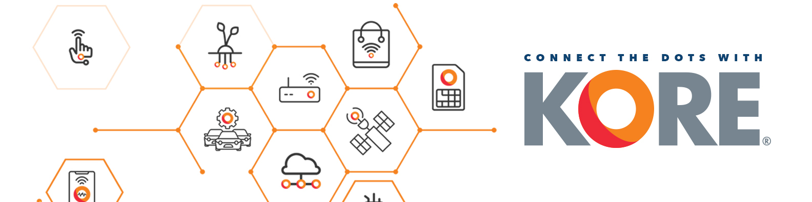
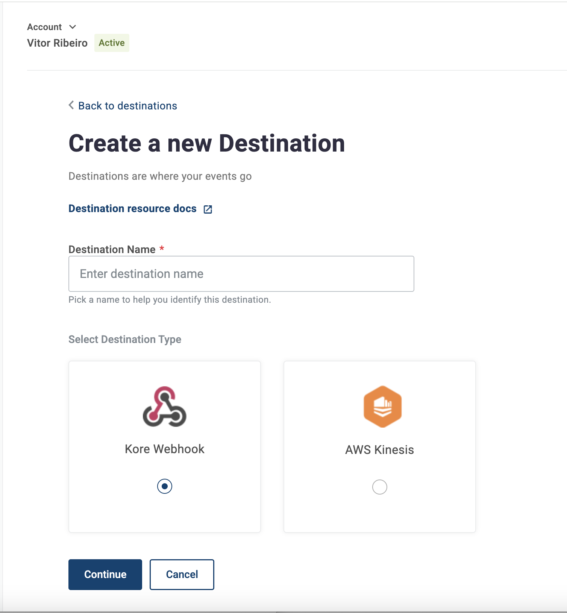
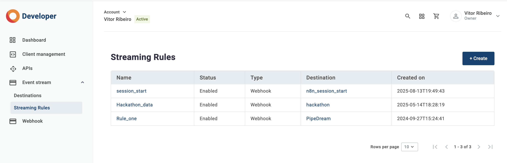
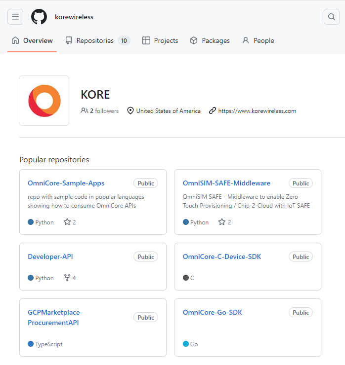

## Introduction

Hi there, my name is **Vitor Ribeiro**, and I am a **Solutions Architect** at [**KORE Wireless**](https://www.korewireless.com).  
As part of my work with customers, I help onboard teams into our developer ecosystem — including features like **Event Streams**, which provide real-time data delivery for KORE products, including **Super SIM**.

This article will show you how to configure **Destinations**, create **Streaming Rules**, and receive events using a **Webhook**.

It’s inspired by the [**official documentation**](https://docs.korewireless.com/en-us/supersim/supersim-first-steps/get-started-with-super-sim-connection-events) but written with a more practical, step-by-step approach. 

Want to see Event Streams in action? Check out my [**SUPER SIM Heatmap tutorial**](/p/build-a-real-time-iot-heatmap-with-kore-super-sim-event-streams/) that builds a real-time visualization dashboard.

---


## Prerequisites

Event Streams are available on the [**KORE Developer Console**](https://build-app.korewireless.com/dashboard).

You will need:
- Contracted for [**KORE SUPER SIM**](https://www.korewireless.com/super-sim/) or registered account at [**KORE Console**](https://console.korewireless.com/)) 
- Access to the [**KORE Developer Console**](https://build-app.korewireless.com/dashboard)  
- A reachable **HTTPS Webhook endpoint**.

If you are **not** a KORE Wireless customer and want access to these services, [contact us here](https://www.korewireless.com/contact-us/).

You don’t need advanced programming knowledge, but you should be familiar with concepts like:

- [Webhooks](https://en.wikipedia.org/wiki/Webhook)
- [JSON](json.org)  
- [CloudEvents](https://cloudevents.io/) & it's [format](https://github.com/cloudevents/spec/blob/v1.0/spec.md)  
- [REST APIs](https://aws.amazon.com/what-is/restful-api/)  

---

## Overview

**Event Streams** allow you to receive real-time events from KORE products delivered to a destination you configure.

The core components are:

| Component | Description |
|----------|-------------|
| [**Destinations**](https://docs.korewireless.com/en-us/developers/event-streams/destinations) | Where events are delivered (Webhook or AWS Kinesis). |
| [**Streaming Rules**](https://docs.korewireless.com/en-us/developers/event-streams/streaming-rules) | Define which events should be delivered and to which destination. |
| [**Event Types**](https://docs.korewireless.com/en-us/developers/event-streams/events) **&** [**Event Schemas**](https://docs.korewireless.com/en-us/developers/event-streams/events#event-schemas) | The structure and versioning of the JSON payloads you will receive. |

This article focuses on helping you set up an end-to-end flow that begins with event delivery and finishes with a working webhook receiver.

---

## Creating a Destination

A **Destination** represents where Event Streams should deliver your data.

You can choose:

- A **Webhook** (recommended for simple setups and testing)
- An **AWS Kinesis Stream** (recommended for production)



---

### Creating a Webhook Destination

1. Log into the [KORE Developer Portal](https://build-app.korewireless.com/dashboard).  
2. Navigate to **Event Streams → Destinations**.  
3. Select **“+ Create”**.  
4. Choose **Kore Webhook** as the destination type.  
5. Provide:

   - **Destination URL** — must be a reachable HTTPS endpoint  
   - **HTTP Method** — typically `POST`

6. Save the destination.

Once saved, open the Destination and use **“Test Event”** to confirm that KORE can reach your endpoint.

> If the test fails, confirm your firewall rules, SSL certificate, or public exposure of your endpoint.

---

## Creating a Streaming Rule

A Streaming Rule defines **which** event types you want and **where** they should go.
---

### Creating a New Rule

1. Go to **Event Streams → Streaming Rules**.  
2. Select **“+ Create”**.  



3. Configure:

- **Rule Status** → `Enabled` or `Disabled`  
- **Destination** → select the destination created previously  
- **Streaming Rule Name**  
- **Product Group** → *Connectivity*
- **Event Types** → choose individual event types  
- **Schema Version** → apply globally or per event type  

4. Save your rule.  
5. Once the rule is **Enabled**, events will begin flowing immediately.

> Use **Disabled** if you are not ready to receive events yet.

---

## Understanding Event Types & Schemas

You can browse all KORE event types in **Event Streams → Events**.

Events follow the **CloudEvents 1.0** specification:

```json
{
  "data": { "...": "event data" },
  "id": "fff521c2-c7db-4b53-a5a0-c5d5d01f66ce",
  "time": "2024-09-25T19:09:48.5842087+00:00",
  "type": "com.kore.eventstreams.test.event",
  "source": "kore-events",
  "dataschema": "/schemas/test/1",
  "specversion": "1.0",
  "datacontenttype": "application/json"
}
```

Why schemas matter:

- They help ensure consistent parsing  
- They provide versioning for long-term compatibility  
- They make downstream analytics easier  

---

## Building a Webhook Server + Heatmap

Below is a simple **Python +** [**FastAPI**](https://fastapi.tiangolo.com/) webhook listener adapted from KORE’s Super SIM Event Streams example plotting START/UPDATE AND ENDED events.

You can download the code from my [**GitHub repository here**](https://github.com/naturalfunction/KORE-SUPERSIM-heatmap). You can read more about the [**KORE SUPER SIM Heatmap here**](https://vitorribeiro.com/p/KORE-SUPER-SIM-Heat-map-using-Event-Streams/).


Expose it publicly using something [**Cloudflare Tunnels**](https://www.cloudflare.com/zero-trust/products/access/):


Then set your Destination URL to:

```
https://yourdomain.com/webhooks/supersim
```

---

## Testing Your Setup

### Test the Destination

Use the **“Test Event”** button in the Destination details on the Developer Portal.

Your server should print the test event.

### Trigger Real Events (Super SIM Example)

When using Super SIM, you will receive lifecycle events such as:

- `connection.attachment.accepted`
- `connection.data-session.started`
- `connection.data-session.updated`
- `connection.data-session.ended`

These events are perfect for dashboards, analytics, or alerting pipelines.

---

## Considerations

Event Streams are powerful, but you should design your system with these best practices in mind:

- **Events may be batched** — up to 50 in a single request  
- **Events may be duplicated** — dedupe using the CloudEvents `id`  
- **Events may arrive out of order** — rely on the `time` property  
- **Webhook endpoints must respond quickly** (< 5 seconds)

For large-scale deployments, consider using **AWS Kinesis** or a message queue downstream.

If you have any questions, feel free to reach out to me [here](mailto:vribeiro@korewireless.com).

---

## Available Resources

### Developer Portal

Visit the [Developer Portal](https://developer-app.korewireless.com) for documentation, API reference, and schema exploration.

### GitHub

KORE offers a GitHub repository with code samples:

- https://github.com/korewireless



More Event Streams examples will be added over time.

---
