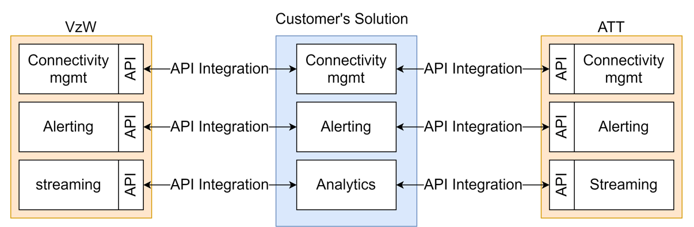
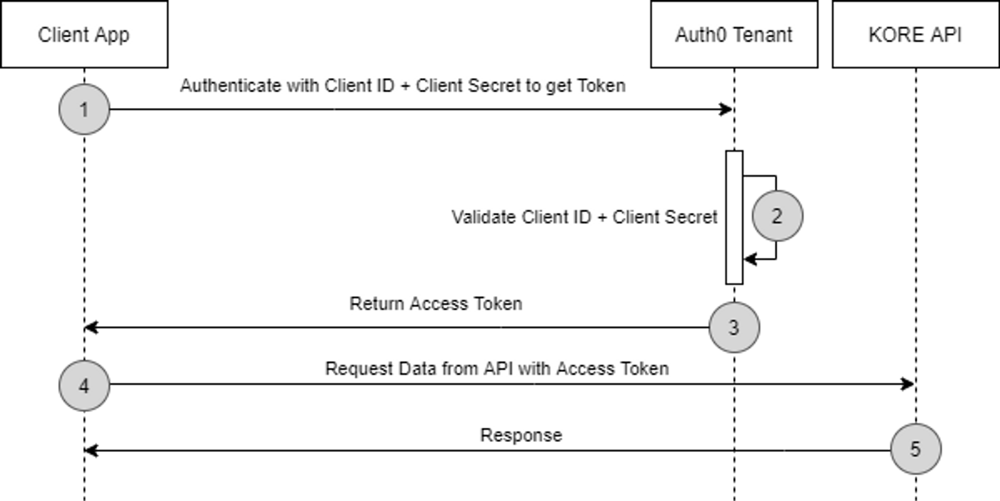
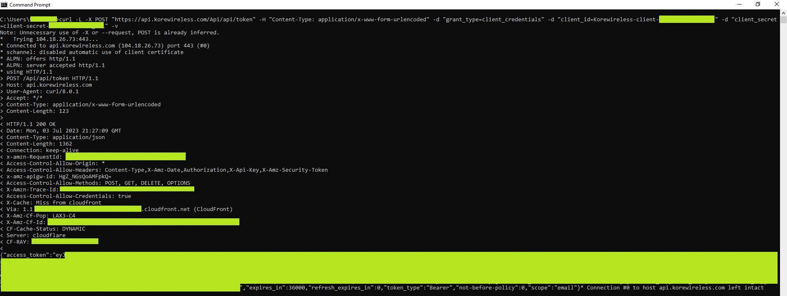
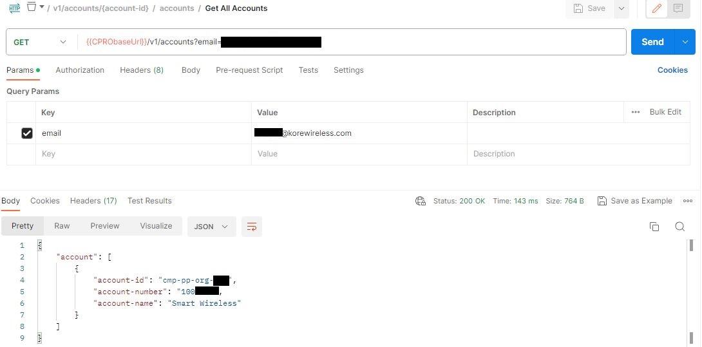
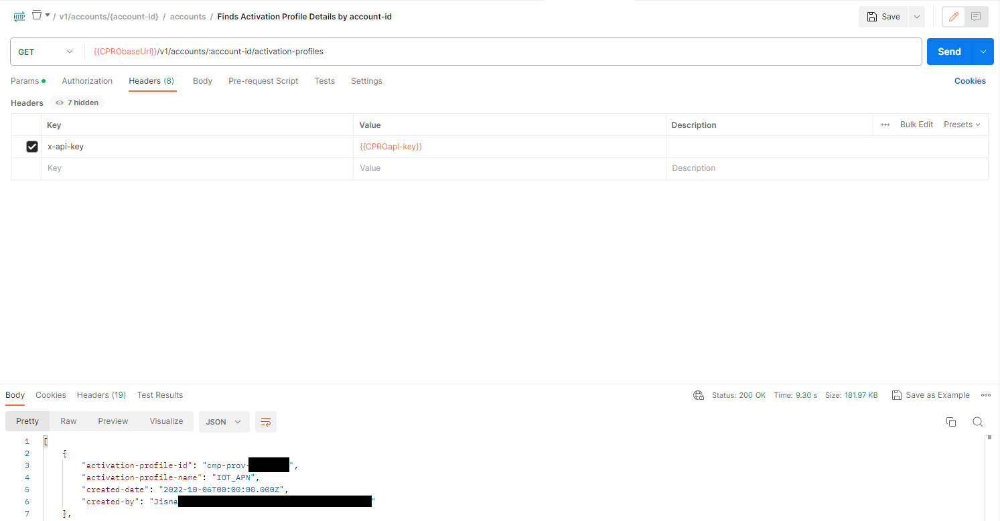
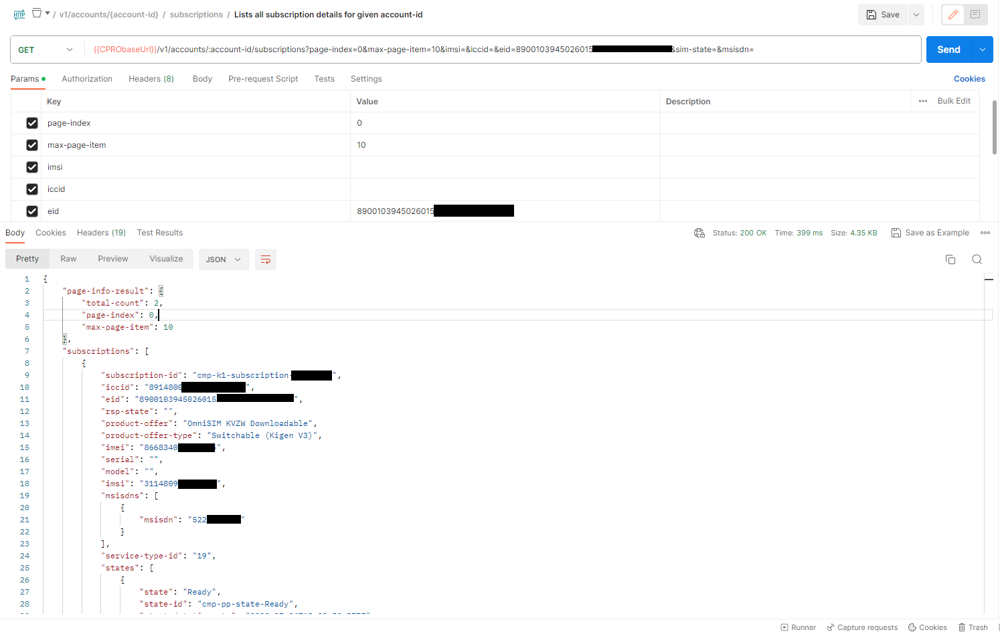
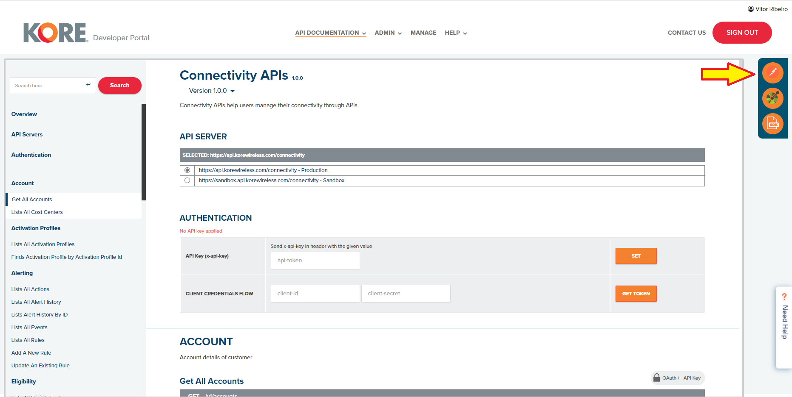
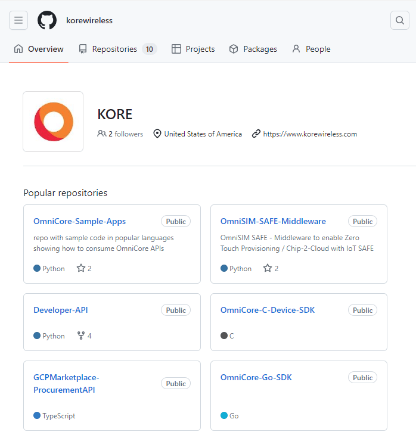

 

## Introduction

Hi there, my name is **Vitor Ribeiro**, and I am a **Solutions Architect** at [**KORE Wireless**](http://korewireless.com).  
Part of my job includes onboarding customers on our [**Developer Portal**](http://developer-app.korewireless.com) for our [**Connectivity API**](https://developer-app.korewireless.com/api?product=Connectivity).  

This article covers some of the frequently asked questions related to our Connectivity API and how to get started.

---

## Prerequisites

You can view the [**Developer Portal API documentation**](http://developer-app.korewireless.com), but to view and manage your API keys, you must be contracted for **KORE Wireless ConnectivityPro™**.  
Otherwise, you won’t be able to see the **Authentication endpoint** described below.

If you are **not** a KORE Wireless customer and are interested in our services, [contact us here](https://www.korewireless.com/contact-us/).

You don’t need to be a software developer but should be familiar with what a **REST API** is.  
AWS has [this article](https://aws.amazon.com/what-is/restful-api/) on REST APIs that can help.  

For API calls, this article uses **Postman**.  
You can watch their [101 videos](https://www.youtube.com/watch?v=hISzpFJ5fPs) or view their [**webinar**](https://www.postman.com/events/intergalactic/) for a quick start.

---

## Overview

The [**Developer Portal**](http://developer-app.korewireless.com) is a public web page for customers, partners, and builders to integrate and leverage **KORE Wireless Services** through APIs.

It enables KORE Wireless to manage all APIs from a single point — referred to as **KORE One™**.

### Available APIs

| API | Description |
|------|-------------|
| **Connectivity** | For ConnectivityPro™; manage SIM subscriptions. |
| **Streaming** | For ConnectivityPro™; KORE’s streaming engine provides developers real time data streams which can be delivered to your infrastructure so you can build solutions with data. |

This article focuses on the [**Connectivity API**](https://developer-app.korewireless.com/api?product=Connectivity), which allows you to manage SIM subscriptions via API.

---

## Why Use KORE's API?

If you are using carriers like [**Verizon**](https://thingspace.verizon.com/documentation/apis/connectivity-management/api-reference.html) or [**AT&T**](https://developer.cisco.com/docs/control-center/cisco-iot-control-center-overview/), your team would need to integrate multiple APIs — each with its own endpoints and structures.  

 

With **KORE Wireless**, you write code against **one unified API endpoint**.  
From that point forward, all service types available under your contract become accessible.

 

---
## Introduction

### Creating a Client

Once you have access to the Developer Portal:

1. Follow the [**Getting Started**](https://developer.korewireless.com/getting-started?id=2.1.1.5) guide to create your first client.  
2. Selecting the client will let you view your **Production** keys.

 

---
### Getting an Authentication Token

Source: [Developer Portal – Getting Started](https://developer.korewireless.com/getting-started?id=2.1.1.3)

KORE uses the **OAuth 2.0 Client Credentials Workflow**.

When you create a client, you receive:

- **Client ID** – Unique identifier of your application  
- **Client Secret** – Used for secure API calls  
- **API Key** – Allows KORE to identify client access

See below for a high-level overview.

 

Using Postman, set up a POST request to https://api.korewireless.com/Api/api/token for Production. 

The body of your request must include:

- The key **“grant_type”** key with a value of “client_credentials”.
- The key **“client_id”** key with a value from the Developer Portal.
- The key **“client_secret”** key with a value from the Developer Portal.

 

You can also use **cURL** to get an authentication token, use the example below to perform a request.

<pre style="background:#1e1e1e;color:#dcdcdc;padding:1em;border-radius:8px;">
<code>
curl -L -X POST "https://api.korewireless.com/Api/api/token" \
  -H "Content-Type: application/x-www-form-urlencoded" \
  -d "grant_type=client_credentials" \
  -d "client_id=[REPLACE_WITH_YOUR_INFO]" \
  -d "client_secret=[REPLACE_WITH_YOUR_INFO]"
</code>
</pre>

Here’s what the **cURL** returns:

 

The authentication Token is valid for 10 hours, after 10 hours, you will need to call the authentication endpoint again for a new token.

---

### Getting the account-id 

Most endpoints from the Connectivity API will require the **“account-id”** as part of the required fields; obtaining your **“account-id”** is essential to interface with KORE’s Connectivity API.

Using Postman, setup a GET request to https://api.korewireless.com/connectivity/v1/accounts?email=<YOUR_EMAIL> 

Your GET request must include:

- The key **“email”** with a value from the Developer Portal.
- A valid Authentication token
- **x-api-key** as part of your headers

 

---

### Getting the activation-profile-id

Using Postman, setup a GET request to https://api.korewireless.com/connectivity/v1/accounts/{account-id}/activation-profiles

Your GET request must include:

- The key **“account-id”** with a value from your previous call
- A valid Authentication token
- **x-api-key** as part of your headers

 

---

## Managing your SIM subscriptions

### Requesting details about a subscription

Using Postman, setup a GET request to https://api.korewireless.com/connectivity/v1/accounts/{account-id}/subscriptions 

Your GET request must include:

- The key **“account-id”** with a value from your previous call
- A valid Authentication token
- **x-api-key** as part of your headers
- A query-string parameter, in my example, I will use the **EID** found on my SIM.

 

---
### Activation

Using Postman, setup a POST request to https://api.korewireless.com/connectivity/v1/accounts/{account-id}/provisioning-requests/activate

Your POST request must include:

- The key **“account-id”** with a value from your previous call
- A valid Authentication token
- **x-api-key** as part of your headers
- A body containing the **Activate** schema

In this example, my subscription state is set to **STOCK**, which is the default state once you place an order and sims are available on your account.

I want to set my state as **test state**, this state allows a customer to perform a device/sim validation test while in the production line without turning the subscription into a billable item.

<pre style="background:#1e1e1e;color:#dcdcdc;padding:1em;border-radius:8px;">
<code>
{
  "activate": {
    "activation-profile-id": "<YOUR_ACTIVATION_PROFILE>",
    "activation-state": "test",
    "subscriptions": [
      {
        "subscription-id": "<YOUR_SUBSCRIPTION_ID>"        
      }
    ]
  }
}
</code>
</pre>

You will be given 3 thresholds for a subscription, a data usage threshold, an SMS usage threshold, and a time threshold. Whichever it is triggered first, set the state to Active - billable. These terms are defined in your contract, you can discuss this with your Account Rep.

For more information on States, read this [article.](https://korewireless.service-now.com/kb_view.do?sys_kb_id=659a58e397eae110d038301e6253af63)

Response Sample:

<pre style="background:#1e1e1e;color:#dcdcdc;padding:1em;border-radius:8px;">
<code>
{
    "status": "success",
    "data": {
        "provisioning-request-id": "cmp-cpro-request-9591174",
        "message": "Your request has been acknowledged"
    }
}
</code>
</pre>

---

## Considerations

This article covered how to get an **Authentication Token**, how to obtain the **account-id**, how to get the **activation-profile-id**, how to get **subscription-id**, and how to **activate** a SIM.

As shown, it is important that your headers include your **x-api-key**, a valid **auth token**, and an **account-id**.

For activation, you must have your **subscription-id** first and your **activation-profile-id**.

If you have any questions, don’t hesitate to reach out to me [here](mailto:vribeiro@korewireless.com).

---
## Available Resources

### Postman Collection

KORE offers a Postman collection that enables you to validate the APIs without writing any code, alternatively, the Developer Portal documentation also includes the ability to call the endpoints, you must be logged into the Developer Portal to view this [Auth Section](https://developer-app.korewireless.com/api?product=Connectivity#auth).

 

---
### Github

KORE Wireless has a [GitHub repository](https://github.com/korewireless) containing code samples. You can view code samples related to the Connectivity API [here](https://github.com/korewireless/Developer-API).

 

You can also read this article on Substack [here](https://vitorr.substack.com/p/getting-started-with-kore-wireless)